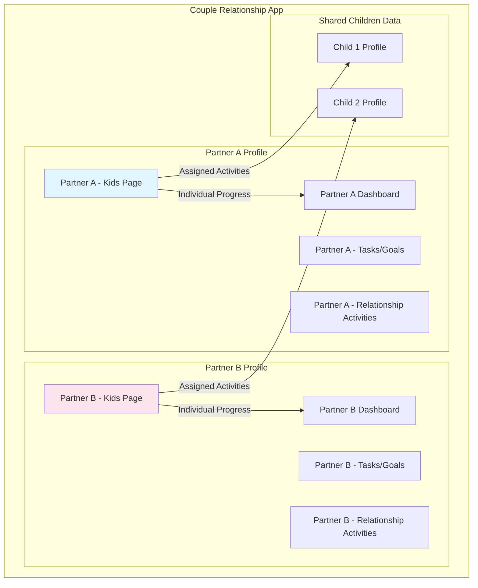
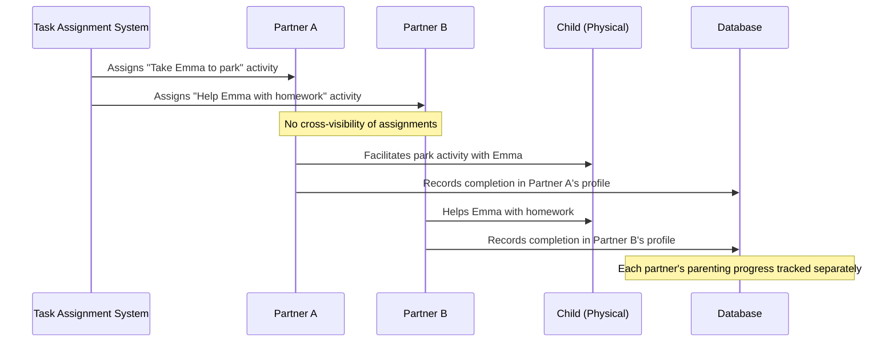
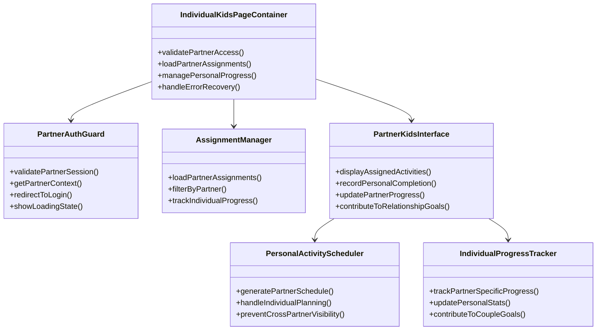
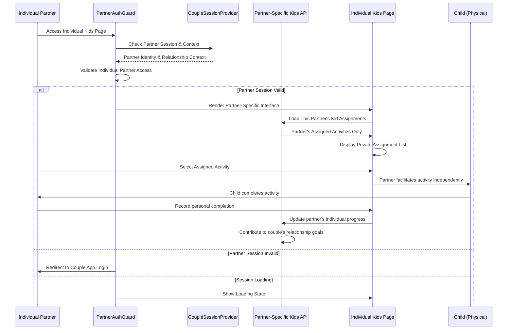
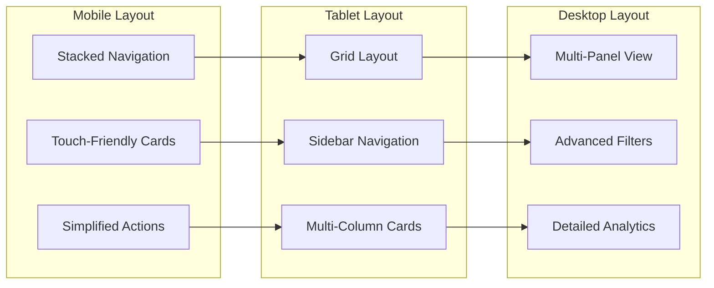
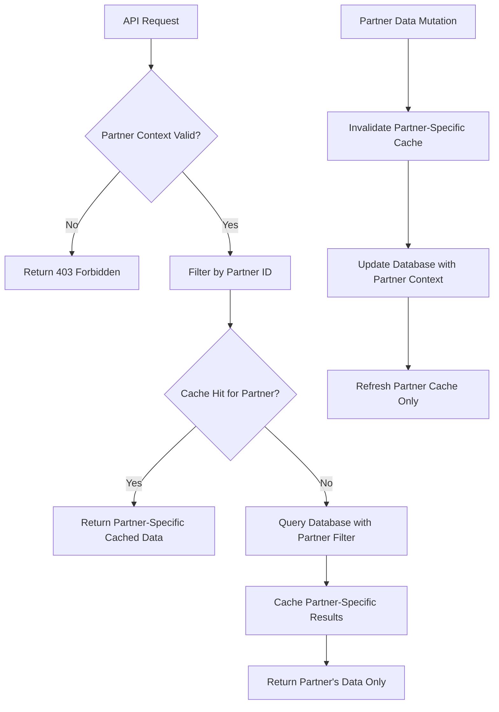
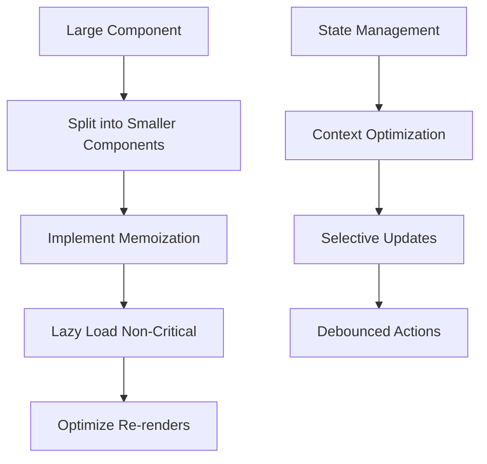

# Kids Page Fix Design Document

## Overview

This design document addresses critical issues in the Kids page implementation within a **couple relationship management application**. The app's primary goal is to strengthen the bond between two partners in a relationship, with each partner maintaining their own separate profile and personalized experience.

**App Context**: 
- **Primary Goal**: Enhance bonding and engagement between romantic partners
- **User Model**: Each partner has their own individual profile (not shared/combined)
- **Kids Feature**: A supplementary feature that allows individual parents to manage and engage with their children
- **Assignment Strategy**: Kids activities are assigned to individual parents separately, with no cross-visibility between partners

The kids page serves as a **personal parenting tool** for each partner to:
- Manage their individual relationship with their children
- Track their personal parenting activities and progress
- Strengthen their own parent-child bond independently
- Complete parenting-related tasks assigned specifically to them

## Individual Parent Assignment Architecture

The kids page operates within a **couple relationship app** where each partner manages their parenting responsibilities independently:

### App-Wide User Model



### Individual Assignment Model



### Privacy & Separation Model

**Key Principles:**
- **Individual Profiles**: Each partner has their own separate app experience
- **Private Task Assignment**: Kids activities assigned to individual parents only
- **No Cross-Visibility**: Partner A cannot see Partner B's kid activities/progress
- **Personal Growth**: Each partner builds their own parent-child relationship
- **Relationship Focus**: Kids feature supports the couple's overall relationship goals

## Current Architecture

The kids page exists within a larger couple relationship app following Next.js App Router architecture:

```mermaid
graph TB
    subgraph "Couple Relationship App"
        subgraph "Frontend Layer"
            CD[Couple Dashboard]
            RD[Relationship Features]
            KP[Individual Kids Page]
            KA[Kids Activities Component]
            KAS[Kids Activity Scheduler]
            UI[UI Components]
        end
        
        subgraph "API Layer - Individual Context"
            AP[/api/kids/profile - Individual]
            AA[/api/kids/activities - Assigned]
            APR[/api/kids/progress - Personal]
            AT[/api/tasks/assignments - Individual]
        end
        
        subgraph "Data Layer"
            DB[(PostgreSQL Database)]
            CACHE[Redis Cache]
        end
    end
    
    CD --> RD
    CD --> KP
    KP --> KA
    KA --> KAS
    KA --> UI
    KP --> AP
    KA --> AA
    KA --> APR
    KP --> AT
    AP --> DB
    AA --> DB
    APR --> DB
    AT --> DB
    AA --> CACHE
```

## Identified Issues

### 1. Individual Assignment & Privacy Issues
- Missing proper individual partner context in data queries
- No separation between Partner A and Partner B kid activities
- Activities not properly assigned to individual parents
- Cross-visibility between partners when there should be privacy
- Missing individual progress tracking per partner

### 2. Couple App Integration Issues
- Kids page not properly integrated with couple relationship context
- Missing connection to partner's individual dashboard
- No proper task assignment system integration
- Activities not contributing to individual partner growth metrics

### 3. API Integration Problems
- APIs not filtering by individual partner context
- Missing proper partner-specific assignment logic
- No proper separation of partner data in responses
- Lack of integration with couple's task/goal system

### 4. User Experience Issues
- Interface doesn't reflect individual partner context
- Missing integration with partner's personal dashboard
- No visual connection to couple's relationship goals
- Activities not clearly marked as individually assigned

### 5. Assignment & Privacy Issues
- No proper task assignment system for individual partners
- Missing privacy controls to prevent cross-partner visibility
- Activities not contributing to individual relationship building
- No integration with couple's overall relationship progress

## Solution Architecture

### Enhanced Component Structure



### State Management Strategy

```mermaid
flowchart TD
    A[Partner Accesses Kids Page] --> B[Validate Partner Identity]
    B --> C{Partner Authenticated?}
    C -->|No| D[Redirect to Couple App Login]
    C -->|Yes| E[Load Partner's Assigned Kid Activities]
    E --> F{Partner Has Assignments?}
    F -->|No| G[Show "No Activities Assigned Yet"]
    F -->|Yes| H[Display Partner-Specific Activities]
    H --> I[Partner Selects Activity]
    I --> J[Partner Facilitates Activity with Child]
    J --> K[Partner Records Completion]
    K --> L[Update Partner's Individual Progress]
    L --> M[Contribute to Couple's Relationship Goals]
    M --> N[Return to Partner's Main Dashboard]
```

## Component Refactoring Plan

### 1. Create Individual Partner-Focused Components

Break down the monolithic KidsActivities component into partner-specific sub-components:

- **PartnerAssignmentView**: Display activities assigned specifically to this partner
- **IndividualEmotionGuide**: Partner's personal approach to helping child with emotions
- **PersonalCreativeGuide**: Partner's individual creative activities with child
- **PartnerKindnessTracker**: Track this partner's kindness interactions with child
- **IndividualProgressDashboard**: Show this partner's parenting achievements (private)
- **CoupleGoalContributor**: Show how this partner's activities contribute to couple goals

### 2. Individual Partner Authentication Enhancement



### 3. Enhanced Error Handling

Implement comprehensive error boundaries and recovery mechanisms:

- **NetworkErrorBoundary**: Handle API failures with retry mechanisms
- **ComponentErrorBoundary**: Graceful degradation for component failures
- **AuthErrorBoundary**: Handle authentication/authorization errors

### 4. Mobile-First Responsive Design



## API Enhancement Strategy

### 1. Partner-Specific Data Filtering



### 2. Individual Assignment API Structure

```typescript
// API Response - Partner sees only their assignments
interface PartnerKidsResponse {
  partnerId: string;
  partnerName: string;
  assignedActivities: Activity[];
  personalProgress: PartnerProgress;
  coupleGoalContribution: CoupleGoalProgress;
  // Note: NO visibility of other partner's data
}

// Database Query - Always filtered by partner
const getPartnerActivities = async (partnerId: string) => {
  return await prisma.kidActivity.findMany({
    where: {
      assignedToPartnerId: partnerId, // Critical: Individual assignment
      isActive: true
    },
    // No joins or includes that could leak other partner's data
  });
};
```

### 3. Privacy-First API Design

- **Partner Context Required**: All API endpoints require partner identity
- **Data Isolation**: Strict filtering prevents cross-partner data leaks
- **Individual Caching**: Cache keys include partner ID for separation
- **Assignment Logic**: Activities assigned to specific partner only
- **Progress Tracking**: Individual partner progress tracked separately

## Accessibility Improvements

### 1. Partner Interface Accessibility

- Full keyboard navigation for individual partner controls
- Proper focus management and visual indicators
- Skip links for efficient navigation within partner's assigned tasks
- ARIA landmarks and labels for partner-specific interface elements
- Clear distinction between partner's tasks and couple's shared goals

### 2. Screen Reader Optimization for Partners

- Descriptive ARIA labels for all partner-specific activity controls
- Live regions for personal progress updates
- Proper heading hierarchy reflecting individual vs couple context
- Alternative text for all visual content
- Clear announcements when partner completes assigned activities

### 3. Partner-Focused Visual Design

- Clear visual indicators showing "Your assigned activities"
- Distinct styling to show individual vs couple achievements
- Visual feedback for partner's personal progress
- Clear connection to partner's main dashboard
- Privacy indicators ("Only you can see this")

## Performance Optimization

### 1. Component Optimization



### 2. Data Loading Optimization

- Implement virtual scrolling for large activity lists
- Use intersection observer for lazy loading
- Optimize image loading with next/image
- Implement proper loading skeletons

### 3. Bundle Optimization

- Code splitting for activity types
- Dynamic imports for heavy components
- Tree shaking for unused utilities
- Optimize third-party dependencies

## Testing Strategy

### 1. Enhanced Unit Testing

- Test authentication flows thoroughly
- Mock API responses consistently
- Test error boundary behaviors
- Validate accessibility compliance

### 2. Integration Testing

- Test complete user workflows
- Validate API integrations
- Test caching mechanisms
- Verify performance metrics

### 3. Accessibility Testing

- Automated a11y testing with axe-core
- Manual keyboard navigation testing
- Screen reader compatibility testing
- Color contrast validation

## Migration Strategy

### Phase 1: Foundation (Week 1)
- Implement authentication enhancements
- Add proper error boundaries
- Create component structure

### Phase 2: Component Refactoring (Week 2)
- Split KidsActivities component
- Implement state management improvements
- Add loading states and error handling

### Phase 3: User Experience (Week 3)
- Enhance mobile responsiveness
- Implement accessibility improvements
- Add progressive loading

### Phase 4: Performance & Testing (Week 4)
- Optimize component performance
- Implement comprehensive testing
- Performance monitoring setup

## Monitoring and Analytics

### 1. Performance Metrics

Track key performance indicators:
- Page load times
- Component render times
- API response times
- Error rates

### 2. User Experience Metrics

Monitor user engagement:
- Activity completion rates
- Session duration
- Feature usage patterns
- Error occurrence frequency

### 3. Accessibility Metrics

Track accessibility compliance:
- Keyboard navigation usage
- Screen reader compatibility
- Color contrast compliance
- Error message clarity

## Implementation Guidelines

### 1. Code Quality Standards

- Follow TypeScript strict mode
- Implement proper error handling
- Use semantic HTML elements
- Follow React best practices

### 2. Component Guidelines

- Keep components focused and small
- Implement proper prop validation
- Use custom hooks for logic reuse
- Follow accessibility best practices

### 3. Testing Requirements

- Minimum 80% code coverage
- All user flows must be tested
- Accessibility tests required
- Performance regression tests

## Risk Mitigation

### 1. Data Safety

- Implement proper data validation for parent inputs
- Use safe defaults for all child data operations
- Validate all parent inputs when recording child activities
- Implement audit logging for parent actions on child data
- Ensure parent-child relationship validation for all data access

### 2. Performance Risks

- Monitor bundle size growth
- Implement performance budgets
- Use performance profiling
- Plan for scale

### 3. User Experience Risks

- Test with real families
- Implement feature flags
- Plan rollback strategies
- Monitor user feedback

## Success Metrics

### 1. Technical Metrics

- Page load time < 2 seconds
- 99% accessibility compliance
- Zero critical security issues
- 95% test coverage

### 2. User Experience Metrics

- Increased activity completion rates
- Reduced error rates
- Improved user satisfaction scores
- Increased session duration

### 3. Business Metrics

- Increased user engagement
- Reduced support tickets
- Improved retention rates
- Higher feature adoption