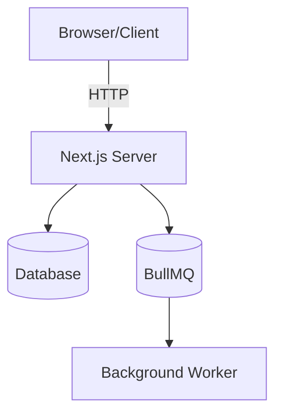

# Architecture Overview

```mermaid
graph TD
    Client[Browser/Client] -->|HTTP| NextApp[Next.js Server]
    NextApp --> DB[(Database)]
    NextApp --> Queue[(BullMQ)]
    Queue --> Worker[Background Worker]
```

The application uses Next.js for server-side rendering and API routes. A BullMQ queue is used for background jobs processed by worker nodes.
